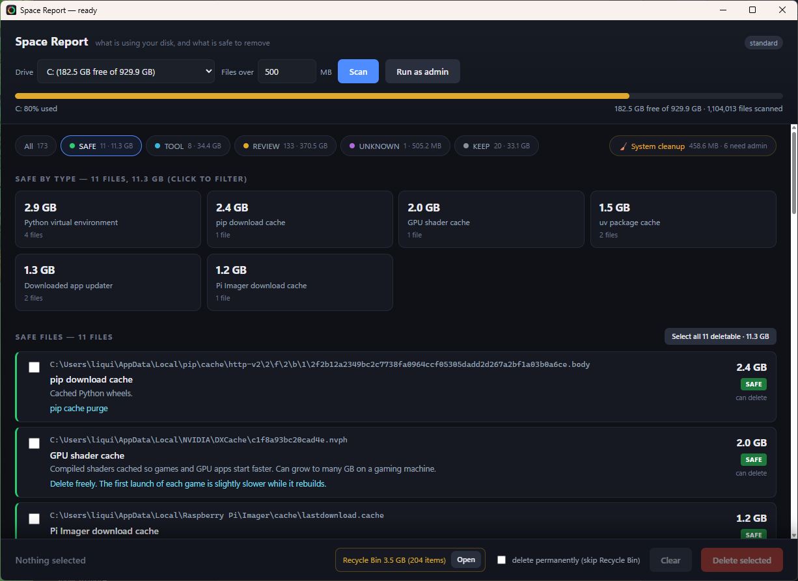
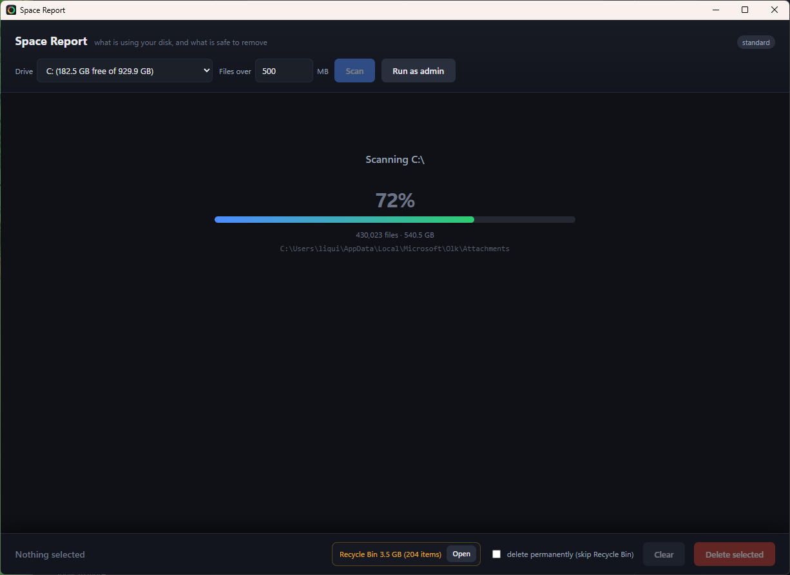
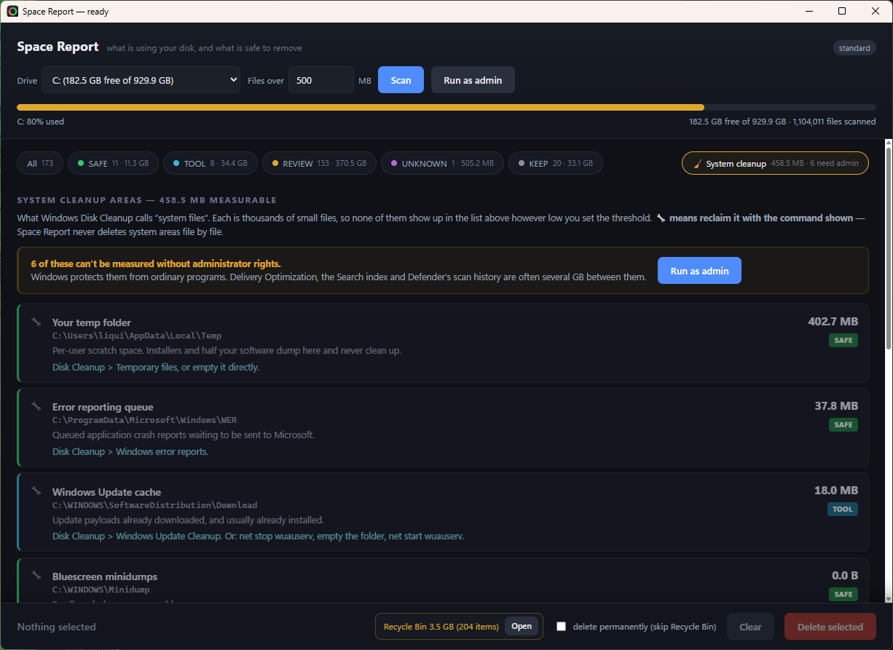

<div align="center">


# Space Report

**Disk usage tools tell you *what* is big. This one tells you what it *is*, and whether you can delete it.**

</div>

---

Every disk analyser gives you the same thing: a treemap full of enormous files with
inscrutable names. `hiberfil.sys`. `System Volume Information`. `WinSxS`. A 6 GB `.ost`.
Which of those can you delete? The tool never says, so you either leave it all alone or
you google each one in turn.

Space Report annotates every large file with a plain-English description, a verdict, and
the *correct* way to reclaim it:

| Verdict | Meaning |
|---|---|
| **SAFE** | Delete freely — rubbish, or it regenerates itself |
| **TOOL** | Reclaimable, but use the command shown, not Explorer |
| **REVIEW** | Your data or your software — only you can decide |
| **KEEP** | Something installed needs this; deleting degrades or breaks it |
| **NEVER** | Deleting breaks Windows or loses data permanently |

Around 100 rules cover Windows internals, dev toolchains, games, creative apps, cloud
sync, browsers and VM disks. Anything unrecognised is reported as **UNKNOWN** rather than
guessed at.

## Two ways to use it

**The app** — pick a drive, scan, tick, delete.

Filter to everything marked SAFE and take the lot in one click:



Progress is a real percentage — bytes scanned against the drive's used space — not a
spinner that tells you nothing:



And the part no big-files tool shows you: the Disk Cleanup categories, which are
thousands of small files each and so can never appear in a size-ranked list:



**The script** — same engine, no GUI.

```powershell
# What is using the drive?
.\Get-SpaceReport.ps1 -Path C:\ -MinSizeMB 1000

# Every file over 5 GB, plus an HTML report
.\Get-SpaceReport.ps1 -MinSizeMB 5000 -Top 0 -Html

# Pick files to delete from a tick-box list
.\Get-SpaceReport.ps1 -MinSizeMB 500 -Clean
```

## Deleting is deliberately hard to get wrong

Files are only removable when a plain file delete is genuinely the right move. Three
categories are held back on purpose:

- **BLOCKED** — verdict `NEVER`, plus a path-based list that protects `.pst`, `.lrcat`,
  virtual disks, game saves, `pagefile.sys` and `hiberfil.sys` **regardless of how they
  were classified**
- **use app** — belongs to a game, Store app or SDK. Removing one file out of an install
  corrupts it; the launcher just re-downloads it
- **use command** — has a proper command, or is locked while Windows runs

That second check keys off the **path**, not the classification, and it exists because
testing found a real failure: a `.pst` sitting under `AppData\Local\Temp` was classified
"your temp folder, SAFE" because a broad location rule matched before the file-type rule.
Location was overriding identity. Rails that depend on classification being right are not
rails.

Everything else:

- Files go to the **Recycle Bin** by default (`-Permanent` to bypass)
- A typed `DELETE` confirmation in the script; a modal in the app
- Refusals are printed loudly, never dropped silently
- The app holds **no** knowledge of what is safe to delete — it shells the script for both
  scanning and deleting, so there is one source of truth and the two cannot drift apart
- Folders are never deletable from the tool. They are shown for context only

## Install

**App** — download `SpaceReport.exe` from [Releases](../../releases) and run it. One file,
nothing to unzip, no .NET install needed. It unpacks its own working files to
`%LOCALAPPDATA%\SpaceReport` on first run.

> Windows will show *"Windows protected your PC"* on first run because the executable is
> unsigned. **More info → Run anyway.** Code signing needs a paid certificate.

Optional arguments, if you want a shortcut that goes straight to a scan:

```
SpaceReport.exe --scan C:\ --min 500 --view system
```

**Script** — PowerShell 7 (`pwsh`) or Windows PowerShell 5.1. No modules needed.

## Build from source

Requires the .NET 8 SDK and the [WebView2 runtime](https://developer.microsoft.com/microsoft-edge/webview2/)
(already present on current Windows 10/11).

```powershell
cd SpaceReportApp
dotnet build -c Release

# The single-file release build:
dotnet publish -c Release -r win-x64 --self-contained `
  -p:PublishSingleFile=true -o ..\publish
```

`ui.html` and `Get-SpaceReport.ps1` are both embedded in the executable *and* copied next
to it. The app prefers the loose copies when they exist, so editing either and rebuilding
takes effect immediately; a published single-file build has neither, so it unpacks the
embedded ones instead.

To regenerate the icon: `pwsh -File SpaceReportApp\make-icon.ps1`
To regenerate the screenshots: `pwsh -File capture-screenshots.ps1`

## How it works

The scan is a compiled C# walker (`Add-Type`) rather than a PowerShell loop, which is the
difference between 35 seconds and several minutes for a full drive. It skips reparse
points deliberately — following junctions double-counts and can loop forever.

Two Windows quirks worth knowing about, both of which produce plausible-looking wrong
answers:

- **`WinSxS` is massively over-reported** by most scanners. Most of its files are hard
  links that also appear in `System32`, so the same bytes are counted twice. Real size:
  `DISM /Online /Cleanup-Image /AnalyzeComponentStore`
- **`new DirectoryInfo("C:")` means the *current directory* on drive C:**, not the root.
  The trailing backslash is load-bearing; without it a "full drive scan" quietly reports
  the working directory instead

## Optional: local LLM descriptions

`-Ollama` sends unrecognised paths to a local [Ollama](https://ollama.com) model for a
best-effort description, via a helper script named `delegate.py` placed beside
`Get-SpaceReport.ps1`. It is skipped silently if that file is not present.

Model verdicts are clamped up to `REVIEW` — a hallucination can never mark something
`SAFE`.

## Contributing

The knowledge base is the interesting part, and it is one readable array at the top of
`Get-SpaceReport.ps1`. If the tool reports something as `UNKNOWN` on your machine and you
know what it is, that is a useful pull request.

Rules match on the full path, **first match wins**, so order matters — put specific
patterns above general ones, and anything irreplaceable at the very top.

## Licence

MIT — see [LICENSE](LICENSE).
